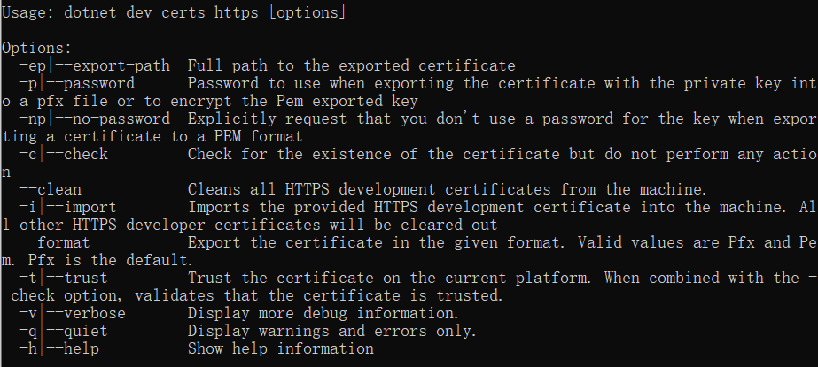
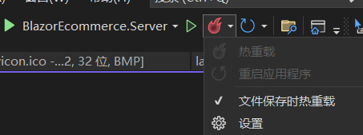

# Blazor WebAssembly制作电子商务网站

## 1. 构架基础

 本程序将会使用 WebAssembly ,ASP.NET Core托管项目,
***

## 2. 解决方案

创建解决方案

打开vs2022>新建项目>选择Blazor WebAssembly 应用> >勾选ASP.NET Core托管(H)

项目结构如下：

```
├─Client 客户端程序
│  │  App.razor 根组件
│  │  Program.cs 
│  │  _Imports.razor 组件全局引用
│  ├─Pages 页面文件
│  ├─Shared 共享组件
│  └─wwwroot 静态文件
                    
├─Server 服务器WebAPI
│  │  appsettings.Development.json
│  │  appsettings.json
│  │  Program.cs
│  ├─Controllers 
│  ├─Pages
│          
└─Shared 共享组件,被Server和Client共用
    │  BlazorEcommerce.Shared.csproj
    │  WeatherForecast.cs
    | ....
```

***

# 3.信任Https证书

cmd中输入 `dotnet ver-cert https --help`



信任https证书之后，在浏览器中调试时会将项目网站视为安全的网站，
不会有安全证书不受信任的警告。这对于后续进行支付功能的开发很重要！


***

# 4.热重载

可以在Developer Command中先转到Server文件夹下，再运行`dotnet watch run `或使用vs2022的热重载功能。该功能允许在程序调试时修改代码，并即时将修改应用到程序，无需等待重新编译。


